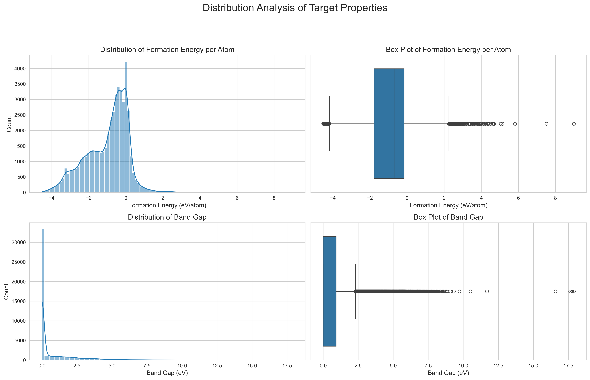
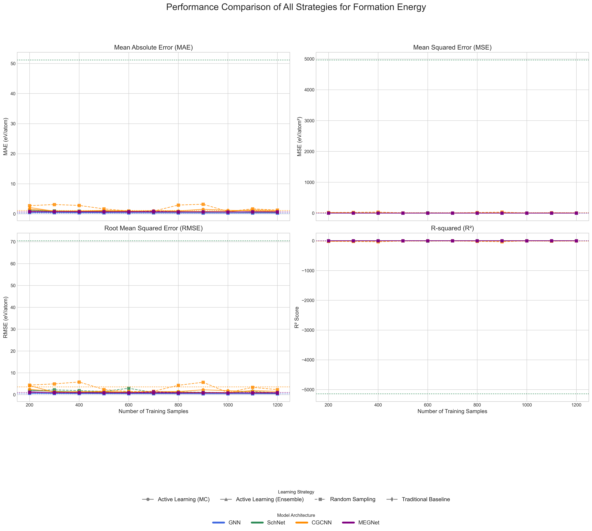
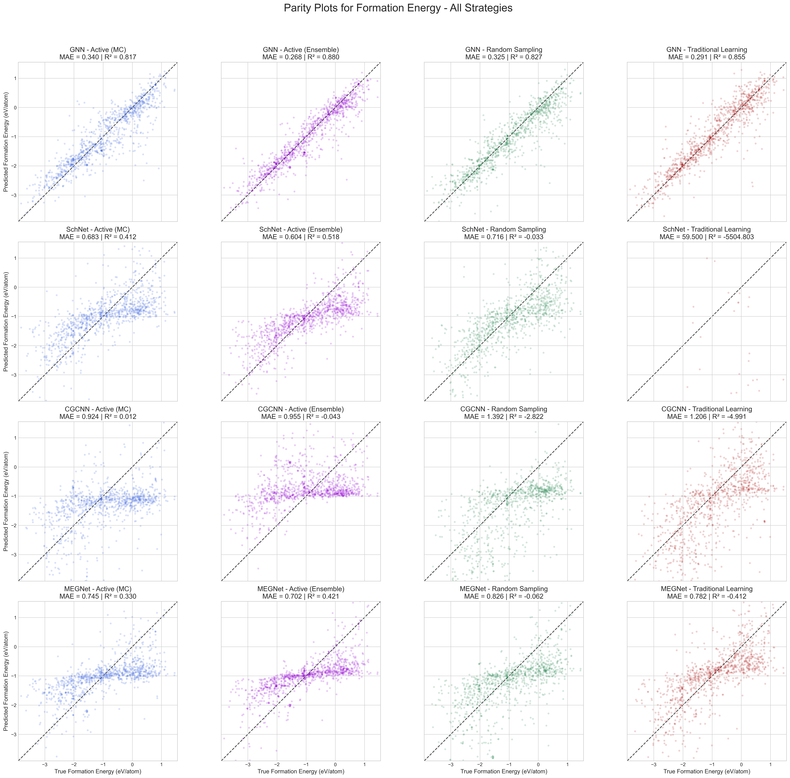

---

# 🚀 **Data-Efficient Multi-Property Prediction of Crystals Using Active Learning & GNNs**

### *Group 14 – IIT Madras (MLMS Course Project)*


---

## 📌 **Project Summary**

This repository contains the complete implementation, datasets, experiments, and results for the project:

> **“Data-Efficient Multi-Property Prediction of Crystals Using Active Learning and Graph Neural Networks”**

This work benchmarks **4 GNN architectures** and **4 learning strategies** on predicting:

* **Formation Energy (FE)**
* **Band Gap (BG)**
  simultaneously (multi-target regression)

using both **filtered** (application-specific) and **unfiltered** (raw, heterogeneous) datasets from the **Materials Project**.

### ⭐ Key Highlights

* 4 GNN models benchmarked: **Custom GNN (GCN), SchNet, CGCNN, MEGNet**
* 4 learning strategies:

  * **Traditional Supervised**
  * **Random Sampling**
  * **Active Learning (MC Dropout)**
  * **Active Learning (Deep Ensembles)**
* 2 datasets:

  * **6,996 curated materials (filtered)**
  * **50,000 raw materials (unfiltered)**
* Extensive comparisons across:

  * Data efficiency
  * Architectures
  * AL strategies
  * Dataset quality

All results, plots, and trained models are included.

---

# 📄 **Project Report (PDF)**

The final 10-page research report submitted for the course:
👉 **`Report.pdf`**

---

# 📁 **Repository Structure**

You can add this in GitHub for clarity.

```
📦 scripts
│
├── 📁 Filtered/                    # Experiments on curated dataset
│   ├── main.ipynb
│   ├── ActiveLearning/
│   ├── TraditionalLearning/
│   ├── RandomSampling/
│   ├── EnsembleActiveLearning/
│   ├── Datasets/
│   └── Results/
│
└── 📁 Unfiltered/                  # Raw dataset experiments (50k materials)
    ├── main.ipynb
    ├── ActiveLearning/
    ├── TraditionalLearning/
    ├── RandomSampling/
    ├── EnsembleActiveLearning/
    ├── Datasets/
    └── Results/
```

Each subfolder contains:

* `.pth` model checkpoints
* `.csv` training histories
* `.pt` graph datasets
* Visualizations (`.png`)
* Queried sample IDs
* Ensemble members
* Scripts for training/evaluation

---

# 🧠 **Research Motivation**

DFT simulations are extremely expensive (hours–days per structure).
This project answers the key question:

### **Can we reduce required training data by actively selecting only the most informative crystal structures?**

We benchmark:

* Different **uncertainty estimation methods**
* Different **GNN architectures**
* Both **filtered & unfiltered** datasets

---

# 🔬 **Methodology Overview**

## 1. Dataset Acquisition & Curation

* 50,000 materials pulled from **Materials Project API**
* Filtered dataset created through **application-driven filtering**:

| Property         | Range (Kept)        | Motivation               |
| ---------------- | ------------------- | ------------------------ |
| Formation Energy | -3.5 to 0.5 eV/atom | Thermodynamic realism    |
| Band Gap         | 0.01 to 1.2 eV      | Practical semiconductors |

Filtering yields a **coherent, physically motivated** dataset of **6,996 crystals**.

## 2. Graph Representation

Each crystal → graph:

* Nodes = atoms (atomic number embedding)
* Edges = neighbors within **5 Å**
* Edge features = interatomic distance

Representation built with **PyTorch Geometric**.

## 3. Models Implemented

### 🔵 **Custom GNN (GCN-based)**

* 3 × GCNConv + ReLU
* Global Mean Pooling
* 2-layer MLP head
* Output: `[FE, BG]`

### 🟣 **SchNet**

* Continuous-filter convolutions
* RBF-expanded distances
* Shifted softplus activation

### 🟢 **CGCNN**

* Gated message passing
* Crystal-specific node–edge concatenation
* Sum pooling

### 🔴 **MEGNet (GAT-based adaptation)**

* GATv2 attention
* Node/edge encoders
* Sum pooling

---

# 🔁 **Learning Strategies Implemented**

### 1️⃣ **Traditional Learning**

Fixed training set of 1,200 samples.

### 2️⃣ **Random Sampling**

Iterative training:

* Start with 200 samples
* Add 100 random samples × 10 cycles

### 3️⃣ **Active Learning (MC Dropout)**

* Dropout active during inference
* 20 stochastic passes per sample
* Query highest-variance points

### 4️⃣ **Active Learning (Deep Ensembles)**

* 5 independently trained models
* Uncertainty = prediction variance across ensemble
* Best performance in our results

---

# 📊 **Key Results (Summary)**

### ⭐ 1. Active Learning is Highly Effective

* Requires **33–50% less data** to reach same performance
* Ensemble AL performs best in most settings

### ⭐ 2. Custom GNN Outperforms Complex Models

* Most stable and accurate model across all scenarios
* SchNet/CGCNN exhibit catastrophic divergence on unfiltered data

### ⭐ 3. Dataset Quality Matters Greatly

* Filtered data: stable & consistent learning
* Unfiltered data:

  * SchNet explodes to **10¹³ loss**
  * CGCNN unstable
  * Only Custom GNN + Ensemble AL survives reliably

### ⭐ 4. Active Learning Selects Informative, Diverse Materials

It explores:

* Extremes of FE/BG
* Structurally diverse crystals
* High-value candidates for DFT follow-up

---

# 📈 **Example Images (Placeholders)**

When you upload, GitHub will render them:







---

# ⚙️ **Installation**

### 1. Create environment:

```bash
conda create -n mlms python=3.10
conda activate mlms
```

### 2. Install dependencies:

```bash
pip install -r requirements.txt
```

If you don’t have the file:

```bash
pip install torch torchvision torchaudio torch-geometric pandas numpy scikit-learn tqdm matplotlib pymatgen joblib
```

---

# ▶️ **How to Run the Project**

The easiest method:

## **Run Jupyter Notebooks**

```
Filtered/main.ipynb
Unfiltered/main.ipynb
```

All experiments (training loops, active learning, visualizations) are automated.


---

# 📁 **Outputs Produced**

By default, results include:

* Model weights: `*.pth`
* Active learning queried IDs
* Histories: `.csv`
* Parity plots & comparison charts: `.png`
* FE/BG predictions for each model
* Distribution visualizations
* Ensemble disagreement curves

Stored in:

```
Filtered/Results/
Unfiltered/Results/
```

---

# ✨ **Author Contributions**

This project was completed **individually**:

**Chamakura Sai Kumar (ED25D402)**

* Proposed research idea
* Coded all 4 GNN models
* Implemented Active Learning pipelines
* Wrote training/evaluation engines
* Curated Materials Project dataset
* Performed all experiments
* Generated all plots
* Wrote the final report (MLMS_IITM.pdf)

---

# 📚 **References**

All citations from the report are included in the PDF.

---

# ❤️ **Acknowledgements**

* Materials Project API
* PyTorch, PyTorch Geometric
* pymatgen
* IIT Madras — MLMS Course

---

# 📬 **Contact**

For questions or collaboration:

📧 **[saichamakura5215@gmail.com](mailto:saichamakura5215@gmail.com)**

---
